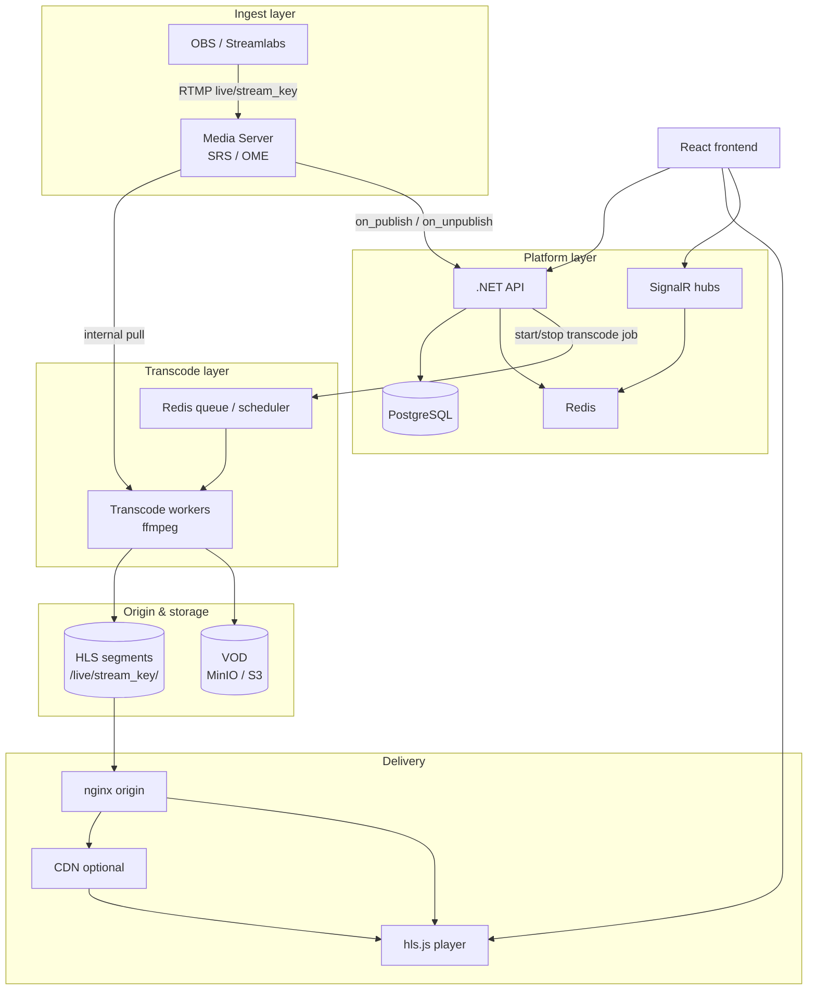
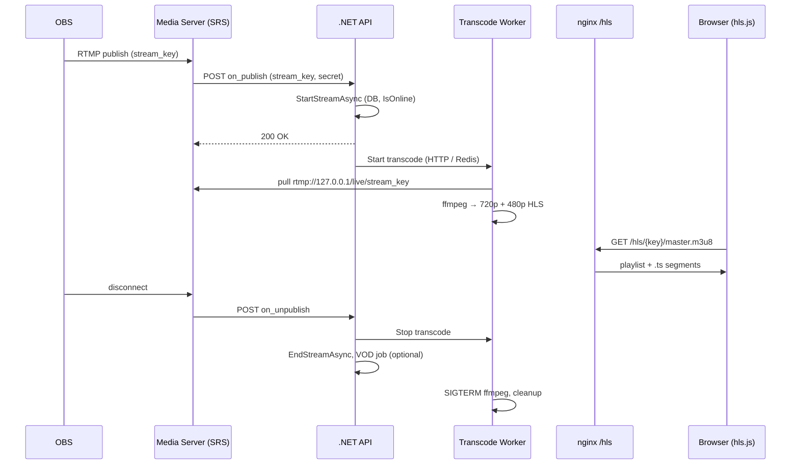
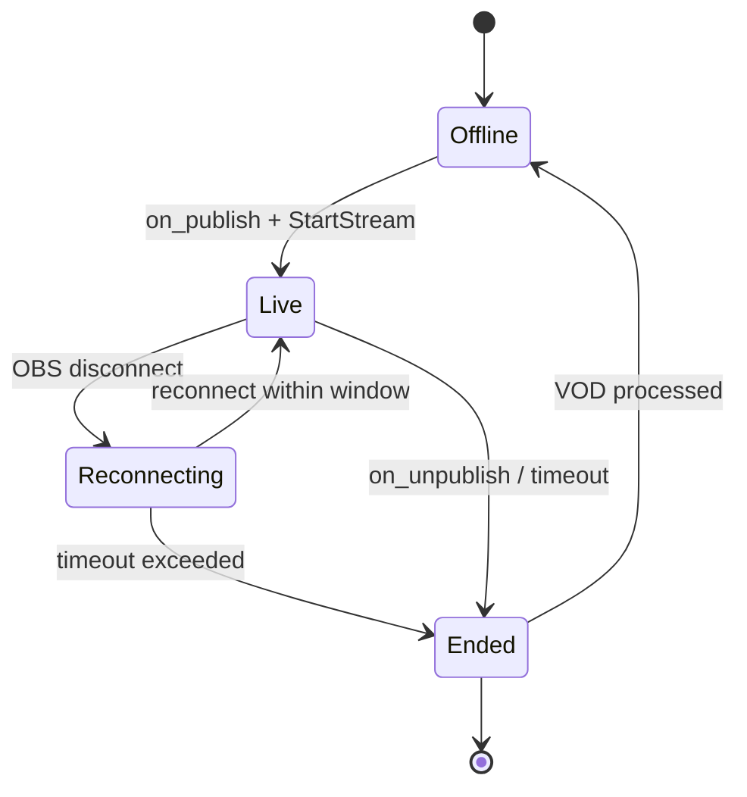
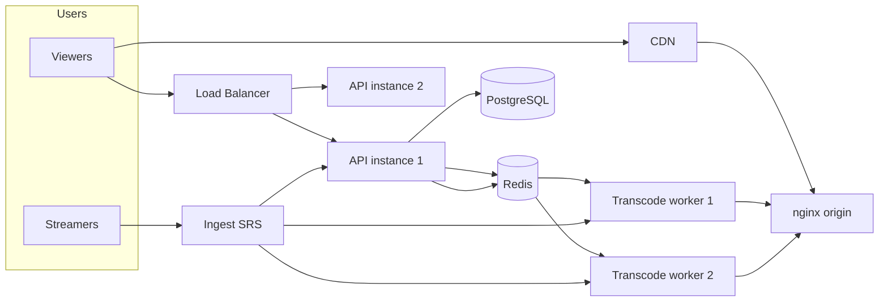

# Roadmap: серьёзная live-платформа (Twitch-модель)

Документ фиксирует целевую архитектуру и поэтапный план развития Stream Platform.  
Обновляйте статус задач по мере выполнения (чекбоксы `- [ ]` / `- [x]`).

**Связанные компоненты репозитория:**

| Компонент | Путь / технология |
|-----------|-------------------|
| Backend API | `StreamPlatformBackend/` (.NET 8) |
| Frontend | `stream-platform-frontend/` (React) |
| Ingest (текущий) | nginx-rtmp |
| Ingest (целевой) | SRS или OvenMediaEngine |
| Transcode | ffmpeg на dedicated worker |
| БД | PostgreSQL |
| Realtime | SignalR + Redis |

---

## Принципы архитектуры

1. **Один ingest от стримера** (OBS → RTMP), несколько качеств делает платформа.
2. **.NET не запускает долгоживущий ffmpeg** — только бизнес-логика и колбэки.
3. **nginx не транскодирует** — ingest/static HLS (на переходном этапе — временно exec).
4. **Транскод — отдельный worker**, управляемый событием start/stop стрима.
5. **Единый контракт URL** для плеера: `/hls/{streamKey}/master.m3u8`.

---

## Целевая архитектура



---

## Поток данных: один стрим от начала до конца



---

## Текущее состояние (на момент создания документа)

| Элемент | Статус |
|---------|--------|
| .NET колбэки `StreamCallbackController` | ✅ есть |
| Stream key `live_{userId}_{guid}` | ✅ есть |
| nginx HTTPS, `/api/`, `/hubs/`, `/hls/` | ✅ есть |
| ffmpeg multi-bitrate (`master.m3u8`) | ⚠️ скрипт есть, `exec_push` отключён |
| nginx-rtmp `hls on` | ❌ нет |
| Запись FLV (`record off`) | ❌ VOD pipeline неполный |
| Единый HLS URL в API | ❌ расхождение `.m3u8` vs `master.m3u8` |
| SRS / отдельный worker | ❌ не внедрено |
| CDN | ❌ |

---

## Фаза 0 — Требования (1–2 дня)

Зафиксировать до активной разработки медиа-слоя.

| Решение | Варианты / заметки |
|---------|-------------------|
| Задержка | Обычный HLS (10–30 с) **или** LL-HLS / WebRTC (сложнее) |
| Ingest | RTMP only **или** + WebRTC (браузер) |
| Качества | 360 / 480 / 720 / 1080; лимит входящего битрейта |
| VOD | Запись да/нет, срок хранения |
| Пиковая нагрузка | N одновременных стримов (10 / 50 / 100+) |
| Модерация, жалобы | MVP / позже |

**Артефакт:** `docs/STREAMING_REQUIREMENTS.md` (опционально) с портами, путями, доменами.

- [ ] Заполнить таблицу решений
- [ ] Зафиксировать целевое N одновременных стримов
- [ ] Выбрать: HLS обычный vs low-latency

---

## Фаза 1 — Стабильный MVP (1–2 недели)

**Цель:** один стример → live в браузере → корректный статус в БД.

### 1.1 Ingest

> Пошаговая инструкция: [INGEST_SRS_SETUP.md](./INGEST_SRS_SETUP.md)  
> Справочные конфиги сервера: `deploy/ubuntu/`

- [ ] Установить **SRS** (или OvenMediaEngine)
- [ ] RTMP: `rtmp://{host}/live/{stream_key}`
- [ ] HTTP hooks → `.NET` `on_publish` / `on_unpublish` (как сейчас для nginx)
- [ ] Снизить зависимость от nginx-rtmp `exec_push`

### 1.2 Transcode Worker v1

- [ ] Вынести `hls_transcoder.sh` в worker-сервис
- [ ] Старт по hook / сообщению; стоп при `on_unpublish`
- [ ] Выход: `/var/www/streamplatform/live/{stream_key}/master.m3u8`
- [ ] `sleep 2` перед ffmpeg, лог `/tmp/rtmp_exec.log`, защита от дублей
- [ ] systemd unit или Docker
- [ ] Права: `www-data` / dedicated user на каталог `live/`

### 1.3 .NET API

- [ ] `Rtmp:Secret`, `Rtmp:PublishUrl`, `Streaming:HlsBasePath` → `appsettings`
- [ ] Единый `playbackUrl`: `/hls/{streamKey}/master.m3u8` во всех DTO
- [ ] `on_publish` быстрый; тяжёлое — background (не блокировать ingest)
- [ ] Endpoint настроек OBS: `rtmpUrl`, `streamKey`

### 1.4 HTTP / HLS (nginx)

- [ ] `location /hls/` → `alias /var/www/streamplatform/live/`
- [ ] CORS, `Cache-Control: no-cache` для `.m3u8`
- [ ] Проверка: `curl`, VLC

### 1.5 Frontend

- [ ] Плеер **hls.js**, URL из API
- [ ] Страница канала: live / offline
- [ ] Инструкция OBS на UI

### 1.6 Наблюдаемость

- [ ] Корреляция логов по `stream_key`
- [ ] `/health` для API
- [ ] Runbook: «стрим не идёт» (5 шагов) — см. конец документа

**Критерий готовности:** 3 тестовых стрима подряд без ручного вмешательства; зритель видит live.

---

## Фаза 2 — Надёжность и продукт (2–4 недели)

**Цель:** поведение «как у продукта», не демо.

### 2.1 Жизненный цикл стрима



- [ ] Reconnect window согласован с worker (не убивать ffmpeg сразу)
- [ ] Heartbeat / `LastPingAt` — таймаут «стример пропал»
- [ ] Идемпотентность `on_publish` / `on_unpublish`

### 2.2 VOD

- [ ] Запись: ingest FLV **или** ffmpeg output
- [ ] **VOD worker** (отдельно от HTTP request) — склейка, upload
- [ ] MinIO/S3 + URL в API

### 2.3 Безопасность ingest

- [ ] Секрет только в env / secrets
- [ ] Rate limit на regenerate stream key
- [ ] Лимит входящего битрейта

### 2.4 Discovery

- [ ] Список live-каналов
- [ ] SignalR: `StreamStarted` / `StreamEnded` на ленте

### 2.5 Чат (база)

- [ ] Лимиты, timeout, mod role

### 2.6 Качество ABR

- [ ] Профили 720p / 480p (битрейты, GOP 2s)
- [ ] Документировать входные рекомендации для OBS

**Критерий:** обрыв 30 с → reconnect; после end → VOD (если включён).

---

## Фаза 3 — Разделение сервисов (1–2 месяца)

**Цель:** 10–50+ одновременных стримов.



- [ ] API stateless за LB
- [ ] Internal URL для hooks (не через public redirect)
- [ ] Redis queue: `TranscodeStart` / `TranscodeStop`
- [ ] Scheduler: max N ffmpeg на ноду
- [ ] Shared volume или S3 для HLS
- [ ] CDN перед `/hls`

**Критерий:** 20 параллельных потоков, нет зомби ffmpeg, предсказуемый CPU.

---

## Фаза 4 — Масштаб и зрелость (ongoing)

- [ ] GPU transcoding (NVENC)
- [ ] Превью / thumbnail worker
- [ ] Аналитика: CCU, watch time, ingest bitrate
- [ ] Клипы, raids (по приоритету продукта)
- [ ] DMCA / report / audit log
- [ ] Signed URLs для приватных стримов
- [ ] Гибрид с облаком (Mux, LiveKit Cloud) при необходимости

---

## Технический долг (включить в Фазу 1)

| Проблема | Файл / место | Действие |
|----------|--------------|----------|
| `exec_push` отключён | nginx.conf | Worker вместо exec |
| HLS URL разный | `StreamController`, `StreamService` | Один `master.m3u8` |
| `record off` | nginx rtmp | Запись на ingest или worker |
| `StreamServerUrl` заглушка | `UserService` | URL из конфига |
| `RTMP_SECRET` в коде | `StreamCallbackController` | `appsettings` |
| Post-process в HTTP | `StreamService` | VOD worker |

---

## Рекомендуемый стек

| Слой | Инструмент |
|------|------------|
| Ingest | **SRS** (старт) → OME при WebRTC |
| Transcode | **ffmpeg** на worker |
| API | **.NET 8** |
| Realtime | **SignalR + Redis** |
| DB | **PostgreSQL** |
| Player | **hls.js** |
| Origin | **nginx** |
| VOD | **MinIO** → AWS S3 |
| CDN | Фаза 3+ |
| Deploy | Docker Compose → K8s |

---

## Контракты URL и ключей

### OBS

| Поле | Значение |
|------|----------|
| Server | `rtmp://{INGEST_HOST}/live` |
| Stream Key | `live_{userId}_{guid}` из API |

### Плеер (live)

```
https://{PUBLIC_HOST}/hls/{streamKey}/master.m3u8
```

### API (пример ответа)

```json
{
  "isLive": true,
  "playbackUrl": "/hls/live_42_abc123.../master.m3u8",
  "rtmpUrl": "rtmp://ingest.example.com/live",
  "streamKey": "live_42_abc123..."
}
```

### VOD (после фазы 2)

```
https://{PUBLIC_HOST}/media/users/{userId}/streams/{streamId}/record.mp4
```

---

## Порядок работ (backlog)

| # | Задача | Фаза |
|---|--------|------|
| 1 | SRS ingest + hooks → .NET | 1 |
| 2 | Transcode worker v1 | 1 |
| 3 | Единый `playbackUrl` в API | 1 |
| 4 | Frontend hls.js + live list | 1 |
| 5 | Reconnect + stop worker | 2 |
| 6 | VOD worker + storage | 2 |
| 7 | Redis queue для transcode | 3 |
| 8 | Вторая transcode-нода + лимиты | 3 |
| 9 | CDN + GPU | 4 |

---

## Метрики готовности

| Метрика | Цель |
|---------|------|
| Time to live | < 5 с от OBS connect до кадра в плеере |
| `on_publish` p95 | < 300 ms |
| Зомби ffmpeg после 100 start/stop | 0 |
| Ingest uptime (одна нода) | 99.9% |

---

## Runbook: «стрим не идёт»

1. **OBS** — Server `rtmp://host/live`, Key = полный ключ из БД.
2. **Ingest** — порт 1935 открыт; лог media server / nginx rtmp.
3. **Колбэк** — `curl -X POST "http://127.0.0.1:5156/api/streamcallback/start?secret=..." -d "name=KEY"` → 200.
4. **HLS на диске** — `ls /var/www/streamplatform/live/{KEY}/` → `master.m3u8`, `720p/`, `480p/`.
5. **Плеер** — URL `https://host/hls/{KEY}/master.m3u8` (не корневой `.m3u8` без `master`).

Логи:

```bash
tail -f /var/log/nginx/error.log
tail -f /tmp/rtmp_exec.log
ps aux | grep ffmpeg
```

---

## Первая итерация (3–5 дней) — старт сейчас

- [ ] Установить SRS, перенести RTMP
- [ ] Worker: старт по hook (не nginx `exec_push`)
- [ ] API: секрет и единый `playbackUrl`
- [ ] E2E: OBS → HLS в браузере
- [ ] Обновить чекбоксы в этом файле

---

## История изменений

| Дата | Изменение |
|------|-----------|
| 2026-05-23 | Первая версия roadmap |
